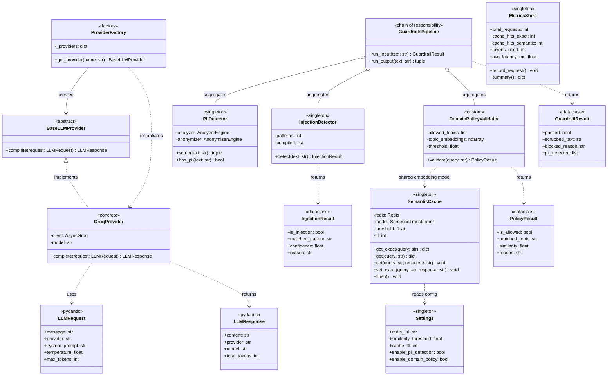

# LLM Gateway

A production-grade API gateway for Large Language Models with semantic caching and a multi-layer guardrails pipeline. Built to reduce LLM API costs and enforce safety policies before requests reach the model.


---

## The Problem

Every LLM API call costs money and takes 1–3 seconds. When multiple users ask semantically identical questions — "what is BFS", "explain breadth first search", "how does level order traversal work" — exact-match caching misses all of them. Additionally, production LLM applications need safety layers to prevent prompt injection, PII leakage, and off-topic abuse.

This gateway sits between your application and the LLM, solving both problems.

---

## Architecture

```
Incoming Request
       │
       ▼
┌─────────────────────┐
│   Input Guardrails  │
│                     │
│  1. Injection Check │ ──── BLOCK (400) ──► "Prompt injection detected"
│  2. PII Scrubbing   │ ──── scrub & continue
│  3. Domain Policy   │ ──── BLOCK (400) ──► "Off-topic request"
└────────┬────────────┘
         │ passed
         ▼
┌─────────────────────┐
│   L1 Exact Cache    │ ──── HIT ──► return in ~1ms
│   (Redis hash)      │
└────────┬────────────┘
         │ miss
         ▼
┌─────────────────────┐
│  L2 Semantic Cache  │ ──── HIT ──► return in ~10ms
│  (Redis Vector KNN) │
└────────┬────────────┘
         │ miss
         ▼
┌─────────────────────┐
│     LLM Call        │
│  (Groq / OpenAI)    │ ──── ~800–1500ms
└────────┬────────────┘
         │
         ▼
┌─────────────────────┐
│  Output Guardrails  │
│  PII scrub on resp  │
└────────┬────────────┘
         │
         ▼
   Cache Store + Return
```

---

## Features

### Semantic Caching (L1 + L2)

- **L1 Exact Cache** — MD5 hash lookup in Redis. Same query twice returns in ~1ms with zero compute.
- **L2 Semantic Cache** — Converts queries to 384-dimensional embeddings using `sentence-transformers/all-MiniLM-L6-v2`. Uses Redis Stack's `FT.SEARCH` with KNN vector similarity to find semantically equivalent past queries. Configurable cosine similarity threshold (default: 0.85).

On a DSA Q&A workload, typical cache hit rates of 60–70% are observed after warmup, directly reducing LLM API costs by the same proportion.

### Guardrails Pipeline

Three-layer input validation ordered by computational cost (cheapest first):

**Layer 1 — Prompt Injection Detection (custom, ~0ms)**
Pattern-based detector covering 5 attack categories: instruction override, role hijacking, system prompt extraction, jailbreak attempts, and delimiter injection. Written from scratch using compiled regex — no external model, no latency overhead.

**Layer 2 — PII Detection & Scrubbing (~20ms)**
Microsoft Presidio-powered detection and anonymization for 8 entity types: email, phone, credit card, IBAN, IP address, person name, location, and crypto addresses. PII is replaced with labeled tokens (`<EMAIL>`, `<PHONE>`) before the query reaches the LLM — ensuring no user data is sent to third-party APIs.

**Layer 3 — Domain Policy Validator (custom, ~30ms)**
Semantic topic enforcement built on the same embedding infrastructure as the cache. Encodes allowed DSA topics as reference embeddings at startup, then computes cosine similarity between the incoming query and each topic. Blocks requests that fall below the similarity threshold. Unlike keyword filters, this understands that "reverse a linked list" is on-topic even without exact keyword matches.

Output guardrails scrub PII from LLM responses before returning to the caller.

### Provider Abstraction

Strategy pattern over LLM providers. All providers implement a common `BaseLLMProvider` interface — swap between Groq, OpenAI, and Anthropic via a single `provider` field in the request body. Adding a new provider requires one file.

### Observability

`GET /metrics` returns a live summary:
- Cache hit rate (%)
- Exact vs semantic cache breakdown
- Blocked request counts by category
- Total tokens consumed
- Average end-to-end latency

---

## Tech Stack

| Layer | Technology |
|---|---|
| API Framework | FastAPI + Uvicorn (async) |
| Cache Storage | Redis Stack (RedisSearch + vector index) |
| Embeddings | sentence-transformers `all-MiniLM-L6-v2` |
| PII Detection | Microsoft Presidio |
| LLM Providers | Groq (Llama 3.1), OpenAI |
| Validation | Pydantic v2 |
| Config | pydantic-settings + dotenv |
| Containerization | Docker + Docker Compose |

---

## Project Structure

```
llm-gateway/
├── app/
│   ├── api/
│   │   └── routes.py          # FastAPI endpoints
│   ├── cache/
│   │   └── semantic_cache.py  # L1 + L2 cache logic
│   ├── core/
│   │   ├── config.py          # pydantic-settings config
│   │   └── metrics.py         # in-memory metrics store
│   ├── guardrails/
│   │   ├── pii_detector.py    # Presidio PII scrubber
│   │   ├── injection_detector.py  # custom regex injection guard
│   │   ├── domain_policy.py   # custom semantic topic validator
│   │   └── pipeline.py        # unified guardrails pipeline
│   ├── providers/
│   │   ├── base.py            # abstract provider interface
│   │   ├── groq_provider.py   # Groq implementation
│   │   └── factory.py        # provider registry
│   └── main.py
├── main.py                    # entrypoint
├── docker-compose.yml
├── requirements.txt
└── .env.example
```

---

## Getting Started

### Prerequisites

- Python 3.10+
- Docker + Docker Compose
- Groq API key (free at [console.groq.com](https://console.groq.com))

### Setup

**1. Clone the repo**
```bash
git clone https://github.com/gupta-vinay123/llm-gateway.git
cd llm-gateway
```

**2. Create virtual environment**
```bash
python -m venv venv
venv\Scripts\activate        # Windows
source venv/bin/activate     # macOS/Linux
```

**3. Install dependencies**
```bash
pip install -r requirements.txt
```

**4. Configure environment**
```bash
cp .env.example .env
# Add your GROQ_API_KEY to .env
```

**5. Start Redis Stack**
```bash
docker-compose up -d
```

**6. Run the server**
```bash
python main.py
```

Server runs at `http://localhost:8000`. API docs at `http://localhost:8000/docs`.

---

## API Reference

### `POST /v1/chat`

Send a message through the gateway.

**Request**
```json
{
  "message": "explain dijkstra's algorithm",
  "provider": "groq",
  "system_prompt": "You are a helpful DSA tutor.",
  "temperature": 0.7,
  "max_tokens": 1024
}
```

**Response — Cache Miss (LLM call)**
```json
{
  "response": "Dijkstra's algorithm is a graph traversal...",
  "cache_hit": false,
  "cache_type": null,
  "provider": "groq",
  "tokens_used": 312,
  "pii_detected": [],
  "latency_ms": 876.4
}
```

**Response — Semantic Cache Hit**
```json
{
  "response": "Dijkstra's algorithm is a graph traversal...",
  "cache_hit": true,
  "cache_type": "semantic",
  "similarity": 0.9119,
  "provider": null,
  "tokens_used": null,
  "pii_detected": [],
  "latency_ms": 14.2
}
```

**Response — Blocked (400)**
```json
{
  "error": "Request blocked by guardrails",
  "reason": "Prompt injection detected: instruction_override — matched 'ignore all previous instructions'"
}
```

---

### `GET /metrics`

Returns live gateway statistics.

```json
{
  "total_requests": 24,
  "cache_hit_rate_percent": 62.5,
  "cache_hits": {
    "exact": 8,
    "semantic": 7
  },
  "cache_misses": 9,
  "blocked": {
    "injection_attempts": 2,
    "off_topic": 3,
    "pii_scrubbed": 1
  },
  "tokens_used": 2847,
  "avg_latency_ms": 187.3
}
```

### `GET /health`

```json
{ "status": "ok" }
```

---

## Class Diagram

---

## Design Decisions

**Why sentence-transformers instead of OpenAI embeddings?**
OpenAI's embedding API adds network latency and cost to every cache lookup, which defeats the purpose of caching. `all-MiniLM-L6-v2` runs locally, produces 384-dim embeddings in ~5ms, and performs well on short Q&A text — the primary use case here.

**Why layer exact cache before semantic cache?**
Exact hash lookup is O(1) with no model inference. For repeated identical queries (the hot path in any real workload), this avoids even the embedding computation. The semantic cache handles paraphrase matching as a fallback.

**Why build the injection detector and domain validator from scratch?**
Libraries like `rebuff` use LLM-as-judge for injection detection, adding 200–500ms per request. Regex-based pattern matching covers the vast majority of real-world attacks at ~0ms. The domain validator reuses the same embedding model already loaded for the cache — zero additional memory overhead.

**Why Redis Stack over Pinecone/Weaviate for vector search?**
Redis Stack collapses the cache store and vector index into a single infrastructure component. This avoids a second network hop to an external vector DB on every cache lookup. For sub-100ms latency targets, this matters.

---

## Environment Variables

| Variable | Description | Default |
|---|---|---|
| `GROQ_API_KEY` | Groq API key | required |
| `OPENAI_API_KEY` | OpenAI API key | optional |
| `REDIS_URL` | Redis connection URL | `redis://localhost:6379` |
| `SIMILARITY_THRESHOLD` | Cosine similarity threshold for cache hits | `0.85` |
| `CACHE_TTL` | Cache entry TTL in seconds | `3600` |
| `ENABLE_PII_DETECTION` | Toggle PII scrubbing | `true` |
| `ENABLE_TOXICITY_CHECK` | Toggle toxicity check | `true` |
| `ENABLE_DOMAIN_POLICY` | Toggle domain policy validator | `true` |

